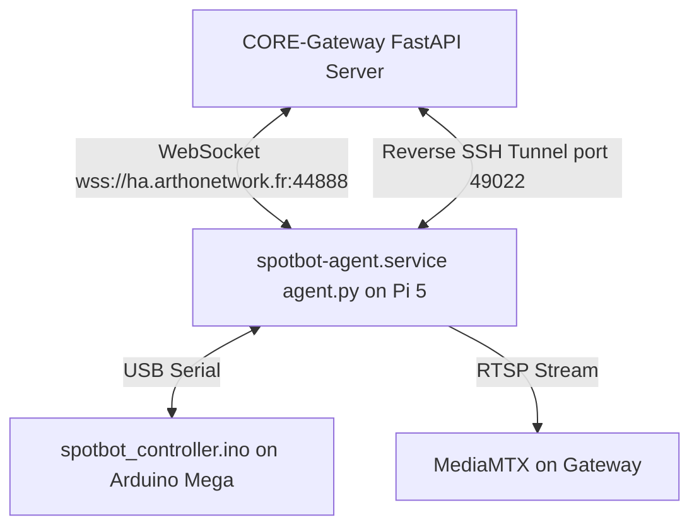

# 🐕 Bastet Robot: Project Architecture & Connection Overview

This document summarizes the system architecture, connection protocols, SSH details, and token mechanisms for the Bastet Robot (SpotBot) project. It is designed to get any developer or AI up to speed instantly.

---

## 1. 🏗️ Global System Architecture

The robot system consists of three main components:
1. **The Gateway (CORE-Gateway)**: A web-based control center and dashboard running a FastAPI server (`main.py`). It coordinates high-level commands, processes live video streams (via MediaMTX/FFmpeg), and manages remote configurations.
2. **The Robot CPU (Raspberry Pi 5)**: Runs the local robot runtime. An agent (`agent.py`) runs as a systemd service (`spotbot-agent.service`) under `root` to communicate with the Gateway via WebSockets and control hardware.
3. **The Microcontroller (Arduino Mega 2560)**: Connected via USB to the Raspberry Pi. Runs the real-time motor loop, kinematics, and sensor reading (`spotbot_controller.ino`).



---

## 2. 🔌 Network & SSH Connections

### 🔑 SSH Credentials
* **Local IP**: `192.168.1.50` (or `192.168.1.166` / `192.168.1.156` depending on network assignment).
* **SSH Username**: `bastet`
* **SSH Password**: `bastet`
* **Default Port**: `22` (local network)

### 🌉 Reverse SSH Tunnel (autossh)
To allow remote access to the robot when it is outside the local network, the robot runs a systemd service: `bastet-tunnel.service`.
* **Tunnel Mechanism**: Connects to the public Gateway server at `ha.arthonetwork.fr` (IP `82.67.220.37`) using `autossh`.
* **Port Forwarding**: Remote port `49022` on the Gateway is mapped to the robot's local port `22` (`localhost:22`).
* **Connection command from the Gateway machine**:
  ```bash
  ssh -p 49022 bastet@localhost
  ```
* **Identity Key**: `/home/tealo/.ssh/gateway_tunnel_key` (runs under user `tealo` or `bastet`).

---

## 3. 🌐 Gateway WebSocket & REST API Security

* **Gateway Domain**: `ha.arthonetwork.fr`
* **API Port**: `44888`
* **WebSocket Endpoint**: `wss://ha.arthonetwork.fr:44888/ws/robot`
* **Authentication Token**:
  ```
  bst_c9f28d3a1e4b85c7f0d4b9a2e6f1c3d5
  ```
  Every request from the robot agent or updater to the gateway must include the header:
  `X-API-Token: bst_c9f28d3a1e4b85c7f0d4b9a2e6f1c3d5`.
  Websocket connection URL: `wss://ha.arthonetwork.fr:44888/ws/robot?token=bst_c9f28d3a1e4b85c7f0d4b9a2e6f1c3d5`.

---

## 4. 📶 WiFi Management

* **Config File**: `/etc/wpa_supplicant/wpa_supplicant-wlan0.conf` (and `/etc/wpa_supplicant/wpa_supplicant.conf` synced by the agent).
* **Service**: `wpa_supplicant@wlan0.service` (manages connection dynamically).
* **Current Active WiFi**: `Freebox-5E6B8A`.
* **Management Flow**:
  1. The agent scans WiFi and reads known network profiles from `/etc/wpa_supplicant/wpa_supplicant-wlan0.conf` (including their passwords).
  2. The agent sends the scan list, the saved passwords list, and the active SSID to the Gateway.
  3. The Gateway pre-fills saved passwords in the connection form, displays the currently active network at the very top of the list, and provides an integrated "Forget" button.
  4. Passwords must be at least 8 characters long (WPA2 standard) to prevent `wpa_supplicant` parsing errors.

---

## 5. 🤖 Firmware Updates & Arduino Flashing

* **Robot Update (colcon build)**:
  * triggered by the Gateway (`trigger_update`).
  * Runs `/opt/spotbot/updater.py` as a standalone root script.
  * Downloads the zip release from GitHub (`Bot-Bastet/CORE`), extracts it, and triggers a sequential `colcon build` to compile the ROS 2 workspace.
  * Reports progress back to the Gateway.
* **Arduino Flash**:
  * The agent (`agent.py`) compiles the sketch using `arduino-cli` with core `arduino:avr:mega` on the Arduino Mega.
  * Before compiling, the agent dynamically reads the current version of the robot from `/opt/spotbot/version.txt` and injects it into the sketch code:
    ```cpp
    #define SKETCH_VERSION "vX.Y.Z"
    ```
  * Once flashed, the Arduino reports its running version over serial telemetry, allowing the Gateway UI to verify that the firmware matches the robot's current version exactly.
